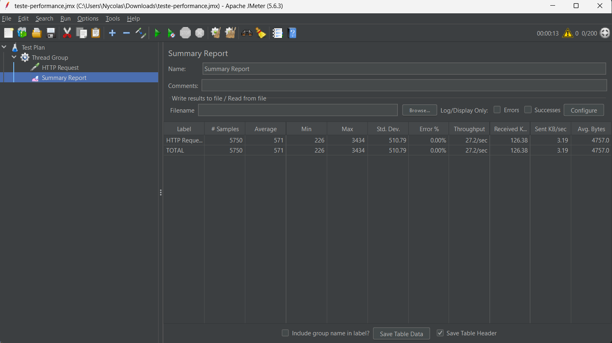

# Desafio Técnico QA

Automação de testes utilizando Cypress para validação de cenários Web e API.

## Tecnologias utilizadas
- Cypress
- JavaScript

---

## Estrutura do projeto

cypress/
 └── e2e/
     ├── web/
     │   └── blog-agi.cy.js
     └── api/
         └── dog-api.cy.js

---

## Testes Web

Foram automatizados cenários no blog do Agibank:

- Busca por termo válido
- Acesso a artigo a partir da busca
- Busca por termo inexistente

Arquivo responsável:
cypress/e2e/web/blog-agi.cy.js

---

## Testes de API

Foram realizados testes utilizando a Dog API:

- Listagem de todas as raças
- Listagem de imagens por raça
- Retorno de imagem aleatória

Arquivo responsável:
cypress/e2e/api/dog-api.cy.js

---

## Como executar o projeto

1. Instalar dependências:
npm install

2. Abrir o Cypress:
npx cypress open

3. Executar os testes pela interface:
- Selecionar E2E Testing
- Escolher o navegador (Chrome)
- Executar os arquivos:
  - blog-agi.cy.js
  - dog-api.cy.js

---

## Observações

Projeto desenvolvido como parte de desafio técnico para avaliação de conhecimentos em QA, contemplando automação de testes Web e API.

---

## Teste de Performance (JMeter)

Foi realizado um teste de carga utilizando o Apache JMeter para validar o comportamento da aplicação sob múltiplos acessos simultâneos.

### Cenário testado
- Endpoint: https://www.blazedemo.com
- Método: GET
- Usuários simultâneos: 50
- Loop: 20 execuções por usuário
- Total de requisições: 1000+

### Resultado

### Métricas observadas

- Tempo médio de resposta: ~571 ms  
- Tempo mínimo: 226 ms  
- Tempo máximo: 3434 ms  
- Taxa de erro: 0%  
- Throughput: ~27 requisições por segundo  

### Análise

A aplicação apresentou estabilidade durante o teste, mantendo 0% de erro mesmo sob carga.  
O tempo de resposta se manteve aceitável, com alguns picos isolados, o que pode indicar variações de rede ou processamento do servidor.

---